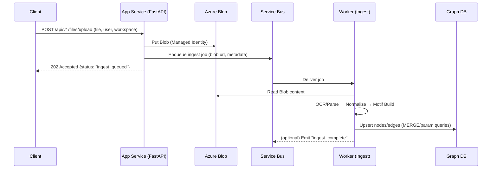
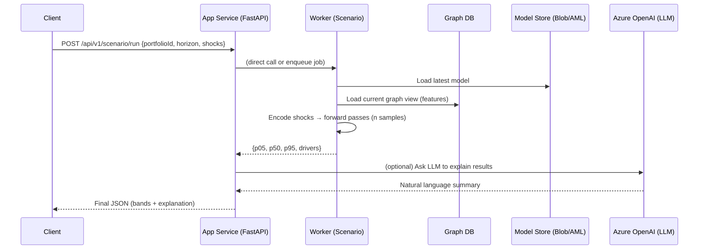

# tqfaAPI — Slimmed-Down Architecture Overview

This document captures the **minimum moving parts** for our Azure-native FastAPI backend that orchestrates file ingest → graph building → GNN inference → LLM explanations.

---

## 1) High-Level Component Map

```mermaid
flowchart TD
  subgraph Client["Clients"]
    UI["Frontends / Tools"]
    Tests["API Tests / CI"]
  end

  UI -->|HTTPS| API
  Tests -->|HTTPS| API

  subgraph App["Azure App Service: tqfaAPI (FastAPI)"]
    API["FastAPI /app"]
    Routes["/api/v1 routes\n(users, workspaces, files, llm, scenario)"]
    DSL["DSL Compiler\n(app/dsl/compiler.py)"]
  end

  API --> Routes
  Routes --> DSL

  Routes -->|Blob SDK (MI)| Blob[(Azure Blob Storage)]
  Routes -->|Service Bus (MI)| SB{{Azure Service Bus\nTopics/Queues}}
  Routes -->|Key Vault (MI)| KV[(Azure Key Vault)]
  Routes -->|Azure AD Token| AOAI[(Azure OpenAI)]
  Routes --> GraphDB[(Graph DB\nCosmos Gremlin or Neo4j Aura)]

  subgraph Worker["Azure Container Apps — Worker Jobs"]
    Ingest["Ingest Worker\n(parse/normalize → motif builder → graph MERGE)"]
    ScenarioW["Scenario Worker\n(load model → predict quantiles → explain)"]
  end

  SB --> Ingest
  SB --> ScenarioW

  Ingest -->|Cypher/Gremlin| GraphDB
  Ingest --> Blob

  ScenarioW -->|Read Model| ModelStore[(Model Artifacts\nBlob / AML Registry)]
  ScenarioW --> GraphDB

  subgraph Training["Azure ML (Batch/Nightly)"]
    Data["Feature Builder\n(Parquet snapshots)"]
    Train["Train Hetero GNN\n(PyTorch Geometric)"]
    Reg["Register Model"]
  end

  Blob --> Data
  GraphDB --> Data
  Data --> Train
  Train --> Reg
  Reg --> ModelStore
```

**Notes**
- **Managed Identity (MI)** everywhere: App and Workers authenticate to KV/Blob/SB/Cosmos/AOAI without credentials.
- Graph DB can be **Cosmos DB (Gremlin)** or **Neo4j Aura** — choose one and keep a thin client wrapper.

---

## 2) Request Lifecycles

### A) File Upload → Ingest → Graph Update


### B) Scenario Run (Portfolio Impact Range)


---

## 3) Code Map (what exists vs what’s stubbed)

- ✅ `app/api/*` — users, workspaces, files, llm, system (existing)  
- ✅ `app/api/scenario_routes.py` — **new** scenario endpoint (stubbed responses)  
- ✅ `app/dsl/compiler.py` — **new** DSL → (future) Cypher/Gremlin (stub parser, safe contract)  
- ✅ `app/gnn/serve.py` — **new** GNN serving adapter (stub bands + drivers)  
- ✅ `tests/test_scenario.py` — sanity import test passing  
- ✅ `docs/ARCHITECTURE.md` & `copilot/INSTRUCTIONS.md` — anchor docs for Copilot

**Next:**  
- Pick **Graph backend** (Cosmos Gremlin vs Neo4j) and implement the client wrapper.  
- Flesh out `predict_quantiles()` using **Azure ML endpoint** or **artifact from Blob**.  
- Expand DSL compiler to map GET/WHERE/RETURN/LIMIT to **parameterized** Gremlin/Cypher.  
- Add **Service Bus** producer (API) + consumers (workers).

---

## 4) Copilot Anchors (put these at file tops)

**Example: `app/dsl/compiler.py`**
```
# Contract:
# - Only support GET/WHERE/RETURN/LIMIT.
# - Whitelisted entities: instruments, portfolios, parties, underlyings.
# - Whitelisted fields: tradeId, type, notional, underlying.symbol, party.name, risk(p05,p50,p95,dv01,delta,vega).
# - Always return parameterized queries; never interpolate user strings.
# - On parse error: raise DslError(hint="...") for safe LLM explanation.
```

**Example: `app/gnn/serve.py`**
```
# Contract:
# - predict_quantiles(portfolio_id, horizon_days, shocks, n_samples) -> dict(p05,p50,p95,units)
# - explain_contributors(...) -> list of {instrumentId|factor, contrib}
# - No cloud credentials inline; read model via MI from Blob or call AML endpoint.
# - Deterministic defaults if model missing; log + return safe fallback.
```

---

## 5) Azure Configuration (env names)

- `BLOB_ACCOUNT_URL`, `BLOB_CONTAINER`
- `KEYVAULT_URL`
- `SERVICEBUS_NAMESPACE`, `SERVICEBUS_QUEUE_INGEST`, `SERVICEBUS_QUEUE_SCENARIO`
- `GRAPHDB_ENDPOINT` (Cosmos Gremlin or Neo4j URI)
- `AZURE_OPENAI_ENDPOINT`, `AZURE_OPENAI_API_VERSION`
- Optional: `AML_ENDPOINT_URL` (if serving via Azure ML Online Endpoint)

> All auth via **DefaultAzureCredential()** with **Managed Identity**.
